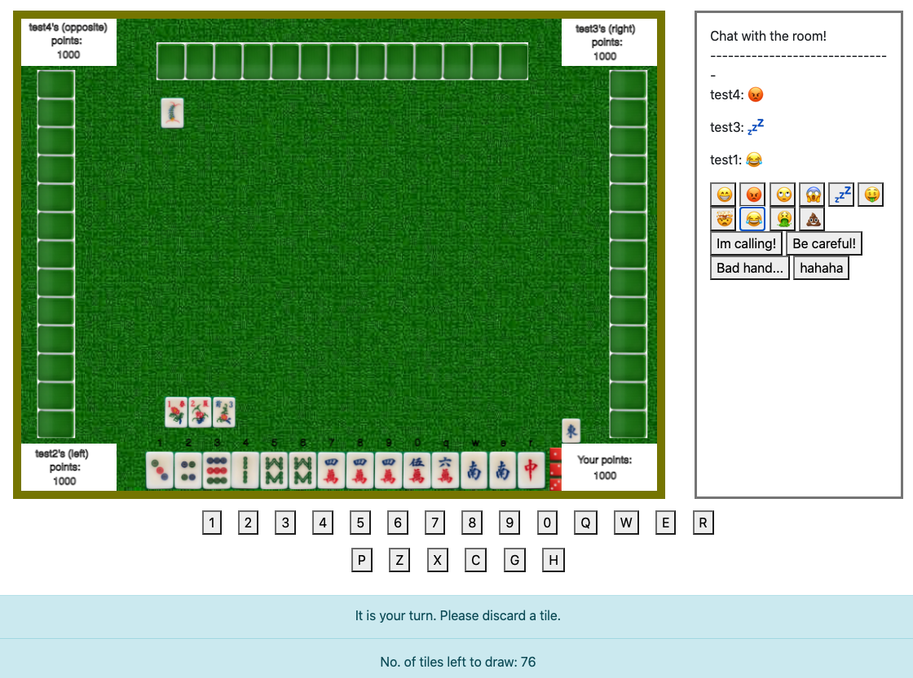

# SG Mahjong
This is a project to play Singapore Mahjong over a web browser with friends and strangers alike!\
You can visit our website to try it out at: [Play SG Mahjong](https://sgmahjong.herokuapp.com/)

## Motivation
While there are other mobile applications and websites for other variants (HongKong, Richi, Against 3 other AI) of Mahjong, this is the pinoeer website that allows for **Player vs Player** variant of **Singaporean styled** Mahjong to be played! The website garnered more than 8000 users within the month of launch (June 2020), and is available on Mobile as well.

## How to use
You can find the instructions for the game on the top left navigation bar under *How to play*.

In order to start a game, grab 3 other friends :family_man_woman_girl_boy:, and join the same room. The tiles will automatically be shuffled and allocated to each player. Alternatively, you can just open 4 separate browser tabs, and join the same room.

Thereafter, you can either use:
* Keyboard (if on desktop)
* Buttons (if on mobile)

## Challenges faced while developing project
This project was created by Ambrose and Wei Howe in April 2020, before we had any formal computer science education. Naturally, it was hard to learn new frameworks as well as adhere to good coding principles. In addition, we faced the following challenges:

### Player Turns
Mahjong is more complex to implement than other usual online games, such as chess or poker. This is because unlike these games, the **player turn** is not strictly defined in Mahjong. In chess, each player always makes a move, and we can simply block the other player from making a move in the browser by setting an arbitary boolean flag `isPlayerTwoTurn = False`.

While the usual flow of the game proceeds from Player 1->Player 2->Player 3->Player 4, the priority of players turns changes with every tile drawn and discarded. In the most simplified model, any player that can 胡 (game) > any player that can 碰 (take 3 of the same tile) > player that can 吃 (take 3 consecutive tiles). As such, we need to listen to inputs from all sockets/players continuously, and block any player's actions which are illegal. This means that Player 2 turn could occur after Player 4's turn if Player 2 has a valid move, which complicated matters compared to a pure turn-by-turn basis.

### Win Conditions and Scoring
Frequent players of Mahjong would know there are infinite amount of permuations that one could win with. Moreover, the same tile could be both used as the *eye* or as a combo piece. This meant running multiple tests on a players tile to see whether he/she had a valid winning combinations, compared to Poker whereby the Hand Ranks at showdown are fixed.

## Framework
This project was created with:
* NodeJs v14.9.0
* Express v4.17.1
* SocketIO v2.3.0

## Usage
Run `npm install` to get dependencies then `npm start`. Point localhost to port 5000.

